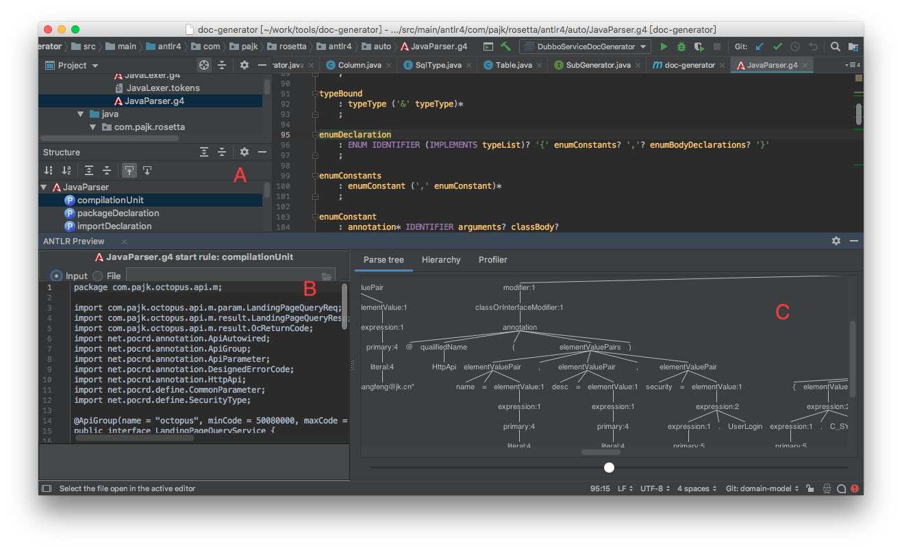
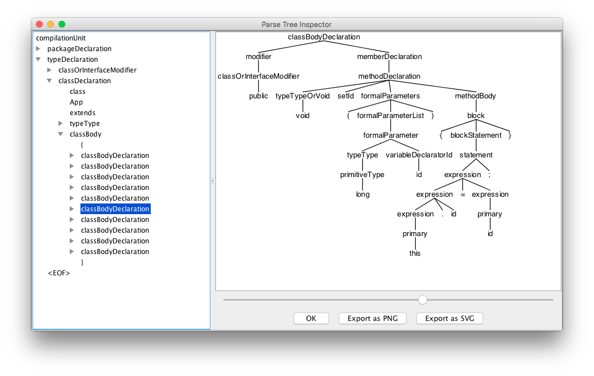

# 简介

本项目实现了一个简单的 gPRC IDL 及数据模型转换生成工具。本文概要说明本工具的使用和开发方法。
本工具的主要功能有：

- 从项目中抽取信息，生成 gRPC protobuf V3 语法的接口定义文件
- 从项目中抽取信息，生成 gRPC 模型和 POJO 模型的类型转换工具

## 使用

本工具支持在 Java 8 及以上版本。之前版本无法运行。
使用本工具之前，请确保被转换的项目的接口和模型已经按业务模块划分好。
本工具为 maven 插件。使用之前请先在接口定义的子项目（一般为 xxx-client 或 xxx-api）的 pom.xml
文件中配置本插件。一般情况下本插件不需要配置即可运作。示例如下：

    <plugin>
        <groupId>cf.tinkerit.mojo</groupId>
        <artifactId>grpc-converter-maven-plugin</artifactId>
        <version>1.0.0-SNAPSHOT</version>
        <executions>
            <execution>
                <phase>generate-sources</phase>
                <goals>
                    <goal>gen-converter</goal>
                </goals>
            </execution>
        </executions>
    </plugin>

为简化命令，可以在~/.m2/settings.xml 文件中加入：

    <pluginGroups>
      <pluginGroup>cf.tinkerit.mojo</pluginGroup>
    </pluginGroups>

然后只用使用 grpc-converter 来指定这个插件。

如果被转化的项目使用非标准的包命名规范。可以通过配置 rootPackage 纠正。
本插件生成的 protobuf 的 Java Package 按照 rootPackage + module 构成。如需在中间加入子包，可以设置
packageInfix。dubboPattern 分别为 dubbo 接口的匹配正则表达式，可空。以下为配置了这些选项的后的示例：

    <plugin>
        <groupId>cf.tinkerit.mojo</groupId>
        <artifactId>grpc-converter-maven-plugin</artifactId>
        <version>1.0.0-SNAPSHOT</version>
        <executions>
            <execution>
                <phase>generate-sources</phase>
                <goals>
                    <goal>gen-converter</goal>
                </goals>
            </execution>
        </executions>
        <configuration>
            <rootPackage>cf.tinkerit.buffalo</rootPackage>
            <packageInfix>your.grpc.model</packageInfix>
            <dubboPattern>.*Service\.java$</dubboPattern>
        </configuration>
    </plugin>

接下来就可以子项目中执行：

    mvn compile grpc-converter:gen-proto

可以生成 protobuf IDL 文件。使用以上命令时生成的　protobuf IDL 文件放在新生成的 `src/main/proto` 子目录下。
以上命令都加上 compile，目的是避免对无法编译的源代码进行 gRPC 转换。请根据实际情况酌情使用。
修复自动生成的 IDL 文件后，就可以执行以下命令生成模型转换程序：

    mvn compile

生成的　`Converters.java` 文件放在新生成的 `target/generated-sources/protobuf/java` 子目录下。
示例如下：

    ├── java
    │   └── com
    │       └── hlt
    │           └── seahorse
    │               ├── booth
    │               │   ├── AppVersion.java
    │               │   ├── AppVersionOrBuilder.java
    │               │   └── converter
    │               │       └── Converters.java
    │               ├── common
    │               │   ├── App.java
    │               │   ├── AppOrBuilder.java
    │               │   ├── AppVersion.java
    │               │   ├── AppVersionAddDTO.java
    │               │   └── converter
    │               │       └── Converters.java
    │               └── popup
    │                   ├── LongReq.java
    │                   ├── LongReqOrBuilder.java
    │                   ├── StringReq.java
    │                   ├── StringReqOrBuilder.java
    │                   └── converter
    │                       └── Converters.java
    └── proto
    ├── booth.proto
    ├── common.proto
    └── popup.proto

按照上述非默认配置生成的 protobuf IDL 定义实例如下：

    syntax = "proto3";

    package seahorse.your.grpc.model.popup;
    import "google/protobuf/timestamp.proto";

    option java_package = "cf.tinkerit.buffalo.your.grpc.model.popup";
    option java_outer_classname = "PopupProto";
    option java_multiple_files = true;

    service PopupConditionAdminService {
        // 分页查询弹屏条件
        rpc pagedQuery (PopupConditionQuery) returns (PopupCondition);

        // 新增弹屏条件
        rpc add (PopupCondition) returns (LongRely);

        // 修改弹屏条件
        rpc update (PopupCondition) returns (Nil);

        // 删除弹屏条件
        rpc delete (LongReq) returns (Nil);

        // 启用弹屏条件
        rpc enable (LongReq) returns (Nil);

        // 废除弹屏条件
        rpc disable (LongReq) returns (Nil);

        // 根据 id 获取
        rpc findById (LongReq) returns (PopupCondition);

    }

    message PopupScenario {
    // 主键
    int64 id = 1;

        // 业务场景编码
        string code = 2;

        // 业务场景名称
        string name = 3;

        // 脚本 id
        int64 scriptId = 4;

        // 业务场景描述
        string description = 5;

        // 状态：1- 新建，2- 生效，3- 失效
        int32 status = 6;

    }

    message LongReq {
        // TODO: 请添加字段说明
        int64 value = 1;

    }

    message Nil {
    }

    ...

## 开发

为了扩展本工具的使用场景，需要更多的开发人员参与到本工具的
开发和维护工作中来。本文档旨在帮助开发者快速入门本工具的开发和维护工作。

### 工具准备

开发本工具建议使用 IntelliJ Idea 最新的社区版。
本工具是基于 ANTLR4 这个语法分析器生成工具设计。开发过程中经常需要
实时预览抽象语法树 (AST Abstract Syntax Tree)，以便编写正确的处理
程序。因此，请安装 ANTLR v4 grammar plugin。
该插件可以从[此下载][1]，也可以在 Idea 中安装。

以下是所涉工具的清单：

- ANTLR v4 grammar plugin
- IntelliJ Idea
- Maven

### 使用 ANTLR 4 grammar plugin 预览语法树

大致步骤如下：
- 在 Idea 里选择相应的语法文件并打开，本例使用 JavaParser.g4
- 点击 structure，展示该语法文件的结构
- 选中一个你需要预览的语法规则，本例中是 compilationUnit
- 唤起右键菜单，点击第一个，本例中是 Test Rule compilationUnit
- 唤起右键菜单，点击第一个，本例中是 Test Rule compilationUnit
- 在下图的 B 区域输入或选择需要分析的 Java 源代码
- 语法树将展示在图的 C 区域

### 使用 ANTLR 4 自带工具预览语法树

预览抽象语法树也可用 ANTLR 4 提供的单独工具。
它自带的 GUI 工具可以选择语法树的子树进行渲染展示。
使用该工具需要从 antlr 官网下载 [antlr-complete.jar][2]。
并创建如下命令脚本 grun:

    #!/bin/sh

    java -cp ".:/path/to/antlr-complete.jar:$CLASSPATH" \
        org.antlr.v4.gui.TestRig $*

以 Java 为例，展示给定 Java 文件的抽象语法树的命令行如下：

    grun cf.tinkerit.doclet.antlr.auto.Java compilationUnit -gui < XXX.java

该工具的界面如下：

[1]: https://plugins.jetbrains.com/plugin/7358-antlr-v4-grammar-plugin
[2]: https://www.antlr.org/download/antlr-4.7.2-complete.jar

11 directories, 72 files
